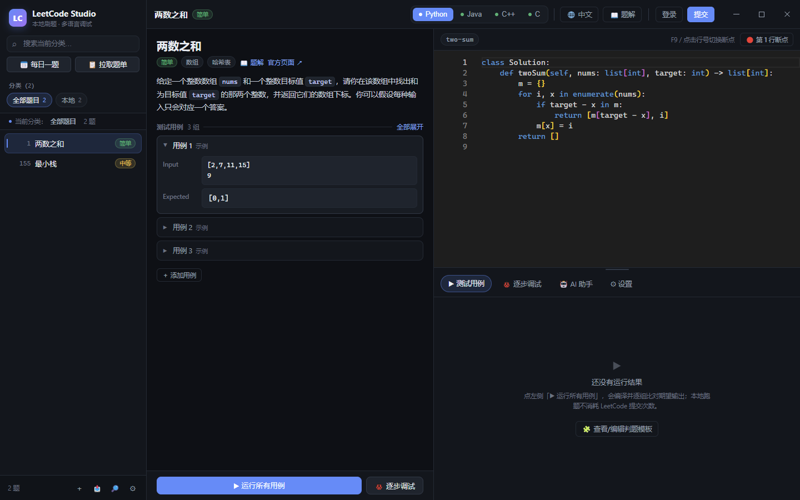
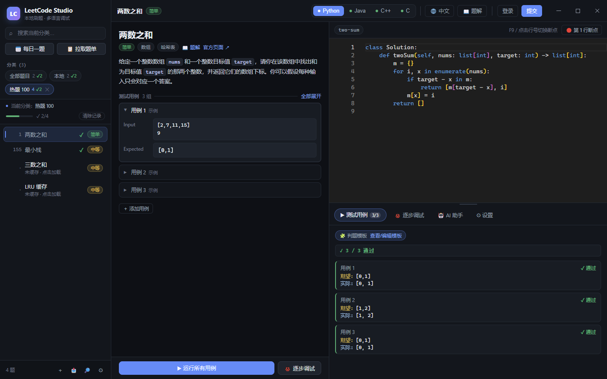
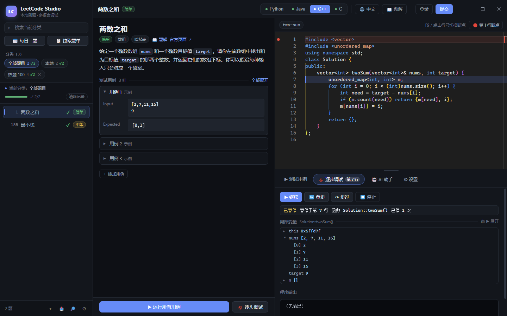
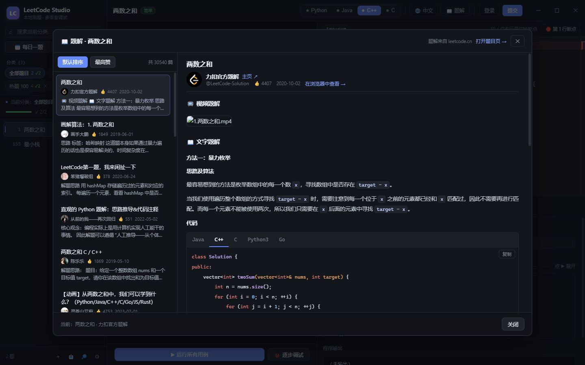

# LeetCode Studio

一个本地运行的 **LeetCode 刷题工作台**：在桌面端管理题目、写代码、跑用例、逐步调试、看题解，必要时让 AI 给一点提示。
基于 Electron + React + TypeScript，**Python / JDK / GCC 工具链随安装包内置**，装完即用，不需要自己配编译环境。

> 定位：把「刷题」这件事完整放进一个本地应用里。题目与测试用例存在本地，运行/调试全部在自己机器上完成，不消耗力扣提交次数。

---

## 📷 界面预览

| 主界面：题面 · 用例 · 编辑器 | 本地运行：逐组比对期望输出 |
| --- | --- |
|  |  |

| 逐步调试：断点 / 单步 / 可展开的变量树 | 题解：作者头像、语法高亮、多语言 tab |
| --- | --- |
|  |  |

## ✨ 功能特性

| 功能 | 说明 |
| --- | --- |
| 📥 在线拉题 | 拉取题目列表与题面、函数签名、各语言 starter 代码；**中文/English 题面一键切换** |
| 📚 题单 / 学习计划 | 官方学习计划（面试经典 150 题、LeetCode 75…）、经典题单、**你自己创建的题单**，均可一键拉成分类 |
| 📝 本地题库 | 描述、标签、难度、可编辑的测试用例；支持新增本地题、从剪贴板导入 JSON |
| ⚙️ 内置工具链 | Python 3.11 / Temurin JDK 17 / GCC 14 + GDB，也可改用系统工具链 |
| ▶️ 本地运行器 | 按题目签名自动生成包装代码，编译并逐组运行用例、比对期望输出 |
| 🐞 逐步调试 | Python（`sys.settrace`）/ C·C++（gdb MI）/ Java（jdb），断点、单步、步过、**可展开的变量树** |
| 📖 题解 | 拉取题解列表与正文：作者头像/昵称、Markdown 渲染、代码语法高亮、多语言代码 tab 切换 |
| ✅ 刷题记录 | 提交通过的题打 √，题单显示通过进度，可按题单一键清零重新刷 |
| ⌨️ 代码补全 | 关键字/片段/成员补全与签名提示；**能补全你自己写的变量、函数、类及其成员**，并感知题目参数与 `ListNode` / `TreeNode` |
| 🤖 AI 助手 | 分级提示 + 纠错，绝不直接给答案（详见下文） |
| 🧩 判题模板 | 内置模板不适配的题型可由 AI 生成、也可自己查看/编辑，还能**发布到共享库**给其他人复用（详见下文） |
| 🎨 现代 UI | 无边框窗口、深色主题、Monaco 编辑器、可拖动分栏 |

## 🧰 支持语言与题型

- **Python**（`python` / `python3`）、**Java**（`javac` + `java`）、**C++**（`g++ -std=c++17`）、**C**（`gcc`）

自动生成的包装代码覆盖常见类型：`integer`、`double`、`boolean`、`string`、`integer[]`、`string[]`、
`integer[][]`、`ListNode`、`TreeNode`，以及**函数型**与**类（构造 + 多方法）型**两类题目。

> C 语言仅支持函数型题目（无类语义）。

部分题目的元数据是「按值引用的节点」（例如最近公共祖先的 `p` / `q` 在元数据中是 `integer`、真实签名却是
`TreeNode*`）。这类题会**解析你写的真实函数签名**判定参数类型，先建好树再按值定位节点，返回值按节点值比较。

## 🚀 快速开始

**环境要求**：Node.js ≥ 20（构建/运行）。Python / JDK / GCC 可选用系统安装的，也可以直接用内置工具链；打包分发的版本已内置，无需另行安装。

```bash
npm install
npm run dev
```

首次运行会使用系统里的 Python / JDK / GCC；如果想用内置工具链（打包版就是这样分发的）：

```bash
npm run toolchains   # 下载并裁剪内置工具链，约 400MB，已存在则跳过
```

其他常用脚本：

```bash
npm run typecheck    # 主进程 + 渲染进程类型检查
npm run check        # 类型检查 + 构建
npm run build        # 构建到 out/
npm run package:win  # Windows NSIS 安装包 → release/
```

### 打包

```bash
npm run package:win    # Windows（NSIS 安装版 + 便携版）
npm run package:mac    # macOS dmg
npm run package:linux  # Linux AppImage
```

打包产物文件名不带空格，以便 `latest.yml` 与实际文件名一致（自动更新依赖这一点）。

## 📁 项目结构

```
src/
  main/                  Electron 主进程
    index.ts             窗口、IPC、自动更新、应用初始化
    fetcher.ts           LeetCode 拉题 / 题面 / 题解
    runner.ts            编译 + 运行 + 用例比对（含判题模板调度）
    harness.ts           各语言包装代码生成（核心）
    aiHarness.ts         AI 生成判题模板（校验 / 验证 / 缓存）
    debugger.ts          调试会话（Python 跟踪 / 原生调试接入）
    nativeDebug.ts       gdb（MI）/ jdb 驱动与变量读取
    ai.ts                AI 助手（分级提示词 + 流式接口）
    toolchain.ts         工具链检测与配置
    store.ts             题目 / 设置 / 目录持久化
    types.ts             题目签名类型模型
  preload/               contextBridge API
  renderer/              React UI（侧边栏 / 题面 / Monaco / 运行 / 调试 / 题解 / AI / 设置）
  shared/types.ts        主进程与渲染进程共享类型
build/                   应用图标（icon.png 源图 / icon.ico 多尺寸）
scripts/                 工具链准备、版本号同步、图标生成、回归脚本
```

## 🧠 判题模板（编译模板）是怎么来的

本地判题需要一段「读输入 → 调用你的解法 → 打印结果」的驱动代码，它按下面的优先级选择：

1. **你自己编辑的模板**（优先级最高）：运行结果区点「🧩 查看/编辑模板」，改完「验证并保存」，之后这道题就按你的模板判。
2. **AI 生成并验证过的模板**：出现「模板疑似不适配」的信号（编译失败，或所有用例都没过且不同输入的实际输出完全一样）时，若已配置 AI Key 且开关打开，会调用 `src/main/aiHarness.ts` 生成驱动；**必须通过本题全部用例**才会被采用并按题目缓存。
3. **内置确定性模板**（`src/main/harness.ts`）：按题目元数据 + 真实函数签名生成，离线、毫秒级，覆盖绝大多数题型。

AI 生成的代码只承担驱动职责，并受这些约束：不能修改解答文件、必须真的调用你的解法、禁止进程/网络/文件操作、禁止把样例期望值硬编码进驱动。
模板缓存位于 `<用户数据目录>/.leetcode-studio/ai-harness.json`（按题目 + 语言 + 函数签名区分，设置页可清空）。

## 🐞 调试实现说明

| 语言 | 方式 | 说明 |
| --- | --- | --- |
| Python | 注入 `sys.settrace` 驱动 | 无需额外依赖 |
| C / C++ | 内置 gdb（MI 协议） | 断点、单步、步过；变量读取**只读内存**（`_M_start/_M_finish`、gdb 变量对象） |
| Java | jdb socket attach | 需要 JDK 带 `jdb`（内置 jlink 运行时已含 `jdb` / `jdk.jdi` / `jdk.jdwp.agent`） |

几个刻意的设计取舍：

- **变量显示不做 inferior call**：早期版本用「在调试目标里执行函数」的方式渲染 STL 容器，一旦该调用卡住（C++ 静态初始化、锁、内存分配都可能触发），gdb 会永久无响应。现在容器内容全部通过读内存解析，`vector` / 嵌套 `vector` / `string` / 对象字段都能**点击展开**。
- **调试产物被占用时自动恢复**：结束调试会结束整棵进程树；若链接仍遇到「文件被占用」，会清理残留进程后重试，必要时更换输出文件名。
- **超时即结束会话**：任何一次调试命令没有响应都会立即结束会话并提示重开，不会让界面停在「运行中」。

## 🤖 AI 做题助手

卡住的时候用它，但它**不会直接给答案**（严格模式默认开启，可关闭）：

- **💡 分级提示**：每点一次只升一级——① 复述题目关键条件与目标 → ② 提出引导性问题 → ③ 给思路方向 → ④ 给步骤骨架 → ⑤ 只给卡点的 3 行关键代码；到第 5 级后改为换角度解释、拆更小的子问题。
- **🔍 纠错**：带上你的代码、失败用例（输入/期望/实际/报错）与调试暂停时的变量，先复述你想做什么，再指出第一处会导致错误的位置与原因，并反问确认，不重写整个函数。
- **上下文可控**：可勾选是否带上「我的代码」「运行结果」；调试暂停时自动附带变量现场。
- **接入方式**：任意 OpenAI 兼容接口（设置页内置 DeepSeek / OpenAI / Moonshot / 智谱 / 本地 Ollama 预设，可一键测试连接）。API Key 只写在本机设置文件，请求由主进程直连，不经过任何中转。

## 🧪 回归脚本

`scripts/` 下除了构建辅助脚本，还有一组可直接运行的回归测试（不依赖 GUI），用于守住容易出现回归的逻辑：

| 脚本 | 覆盖内容 |
| --- | --- |
| `debug-lock-test.ts` | 调试产物被残留进程占用时的自动清理与重试 |
| `step-over-test.ts` | 含 STL 的解法连续步过的耗时与停靠正确性 |
| `var-tree-test.ts` | 变量树展开（容器、嵌套容器） |
| `stl-render-test.ts` | 各类容器/字符串的预览渲染 |
| `node-ref-test.ts` | 「按值引用的节点」题型（最近公共祖先等）三语言跑通 |
| `harness-edit-test.ts` | 判题模板的查看 / 编辑 / 验证 / 恢复 |
| `ai-harness-test.ts` | AI 判题模板管线（打桩模型：生成 → 验证 → 缓存 → 拒绝回退） |
| `content-lang-test.ts` | 题面语言索引（中文标题来源、详情语言、缓存） |
| `record-test.ts` | 刷题记录的写入、保护与清理 |
| `symbols-test.ts` | 代码补全的符号提取（四语言的变量/函数/类型/成员） |
| `p160-test.ts` / `locals-test.ts` / `lca-236-test.ts` | 具体题型的运行与调试回归 |

运行方式（示例）：

```bash
npx tsc scripts/record-test.ts --outDir .tmp-t --module commonjs \
  --target es2020 --moduleResolution node --esModuleInterop --skipLibCheck
node .tmp-t/scripts/record-test.js
```

> 这些脚本不需要网络或 API Key（`ai-harness-test.ts` 使用打桩模型）。

## 📦 内置工具链

工具链不入库，由 `npm run toolchains` 按固定版本下载并裁剪，打包时作为资源一起分发：

| 组件 | 版本 | 来源 |
| --- | --- | --- |
| Python | 3.11.9 embeddable | python.org |
| GCC / G++ / GDB | w64devkit v2.0.0（GCC 14.2.0 + GDB 15.1） | skeeto/w64devkit |
| Java | Temurin 17.0.2 → jlink 裁剪（保留 `jdb` / `jdk.jdi` / `jdk.jdwp.agent`） | Adoptium |

## 🚀 发布与自动更新

发布由 GitHub Actions 完成，流程是：**打 tag → 构建 → 创建 Release**。

```bash
node scripts/bump-version.mjs 1.1.14   # 同步 package.json / lock / README 中的版本号
# 更新 RELEASE.md 的更新说明
git commit -am "release: v1.1.14"
git tag v1.1.14 && git push origin main --tags
```

推 tag 后 [`.github/workflows/main.yml`](.github/workflows/main.yml) 会：

1. **test**：`npm ci` + 类型检查 + 构建（push 与 PR 时都跑）
2. **build**（windows-latest）：准备内置工具链 → 构建 → `electron-builder --win` 产出安装包与 `latest.yml` → 上传产物
3. **release**（仅 tag）：下载产物 → 创建 GitHub Release

客户端使用 `electron-updater`：启动后自动检查、后台下载、退出时安装；设置页「关于与更新」可手动检查与重启安装。
默认更新源是 **GitHub Releases**；也支持指向自建镜像（对象存储 / CDN）以加速分发 —— 若配置了镜像，
应用会优先走镜像，失败自动回退 GitHub。要换镜像地址，设置环境变量 `LC_UPDATE_MIRROR` 即可（见 `src/main/index.ts`）。
调试更新问题时可以看 `<用户数据目录>/.runtime/updater.log`。

## 📄 License

MIT
